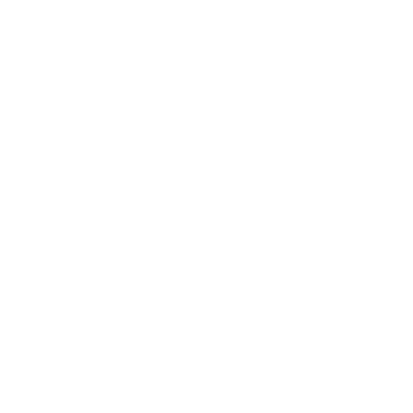

# CapturePlayer

**Version 0.2.0**

A minimalist capture card viewer for PC gaming and Discord streaming. Built for Nintendo Switch and other consoles.

## What's New in v0.2.0

- **Autostart Function** - Launch with capture already running
- **Custom Aspect Ratio Presets** - Create and save your own aspect ratios  
- **Color Presets System** - Save favorite brightness, contrast, saturation & hue combinations
- **Zoom Control** - Zoom in/out with Ctrl + Mouse Wheel (fullscreen & windowed)
- **Complete Settings Overhaul** - New preset-based configuration system
- **Improved Design** - Enhanced UI/UX throughout the application

## The Problem

When you want to play Nintendo Switch games on your PC monitor through a capture card and stream it on Discord, OBS is unnecessarily complicated:
- You need to configure audio routing
- Set up the preview projector to show only the video
- Deal with UI elements you don't need
- Navigate through complex menus just to view your console

## The Solution

CapturePlayer does one thing perfectly: **Shows your capture card feed. Nothing else.**

## Key Features

### Clean Viewing Experience
- Only the capture card image is displayed - no buttons, no toolbars
- Controls appear on hover and automatically hide themselves
- Perfect for gaming without distractions

### Performance
- Same low latency as OBS
- Synchronized audio and video
- Lightweight on system resources

### Smart Display & Customization
- Automatic aspect ratio detection - window adapts to your input signal
- **Custom aspect ratio presets** - create and save your own ratios
- Fullscreen mode with **zoom control** (Ctrl + Mouse Wheel)
- Always on Top option to keep window visible
- **Color adjustment presets** - save your favorite brightness, contrast, saturation & hue settings

### Simple Configuration
- Quick device switching in settings
- **Autostart function** - automatically starts capture when app launches
- **Preset management** - save and load your favorite settings combinations
- No complex setup required
- Works immediately after connecting your capture card

## Perfect For

- Playing Nintendo Switch on your PC monitor
- Streaming console games on Discord
- Quick capture card viewing without streaming software overhead
- Anyone who finds OBS overkill for simple capture viewing

## Installation

Download the latest release from [GitHub Releases](https://github.com/galusperes/CapturePlayer/releases/latest):

- **Installer:** `CapturePlayer.Setup.0.2.0.exe` - Standard Windows installation
- **Portable:** `CapturePlayer.0.2.0.portable.exe` - No installation needed

## How to Use

1. Connect your capture card to your PC
2. Launch CapturePlayer
3. Click "Start Capture" or enable autostart in settings
4. **Customize your experience:** Create aspect ratio and color presets in settings
5. **Zoom in/out:** Hold Ctrl + scroll mouse wheel (works in fullscreen too)
6. Play your game!

**For Discord streaming:** Share your screen and select the CapturePlayer window

## Screenshots

*Clean display with auto-hiding controls*

*Simple device and color adjustment settings*

## Tested With

- Elgato HD60 S+
- Nintendo Switch 2
- Windows 11

## Why Not OBS?

OBS is great for streaming, but CapturePlayer gives you instant, clean capture card viewing. The video appears directly in the correct aspect ratio as a window with sound - no buttons, no UI, just clean video. Perfect for gaming and Discord streaming without preview workarounds.

## License

MIT License

---

Built for gamers who just want to play. Created by [galusperes](https://github.com/galusperes)