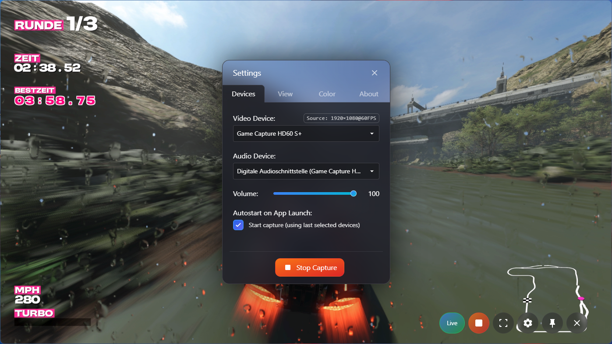

# CapturePlayer

**CapturePlayer** is a minimal desktop app that makes it effortless to view and share your capture card’s video and audio – perfect for gaming, consoles, or presentations.

---

## Why I built CapturePlayer

Setting up OBS or similar tools just to display and stream a capture card to Discord was always a hassle for me. I was tired of fighting with complex menus, wrong aspect ratios, and desynchronized audio.

That's why I built **CapturePlayer**:  
A simple, modern app that instantly shows your capture card’s video and audio with one click.  
No complicated setup, no overlays, no advanced configs — just your image and sound, always in sync.

---

## Key Features

- **Instant Preview:** One click, and your capture card signal is shown in a window.
- **Auto Aspect Ratio:** The correct format is detected and set automatically.
- **Synchronized Audio:** No more lag between video and sound.
- **Pin to Top:** Keep the window always visible, even while multitasking.
- **Customizable Colors:** Adjust the UI for your personal style.
- **Modern, minimal look:** Built with Electron, React, Vite, and Tailwind CSS.
- **Tested with:** Elgato HD60 S+

---

## Installation

Download the latest release from [GitHub Releases](https://github.com/galusperes/CapturePlayer/releases/latest).

- **Installer:** Download and run `CapturePlayer.Setup.0.1.0.exe` to install CapturePlayer.
- **Portable:** Download and run `CapturePlayer.0.1.0.portable.exe` – no installation required.

---

## Usage

1. Launch **CapturePlayer** (from Start menu if installed, or directly via portable EXE).
2. Connect your capture card.
3. Click **Start Capture**.
4. Share the window in Discord (Screen Share) or any video call app.

---

## Screenshots

Below: CapturePlayer in action with an Elgato HD60 S+

*Tip: To add your own screenshots, simply save your images as `screenshot_main.png` and `screenshot_settings.png` in the same folder as this README, or update the filenames above to match yours!*

---

## Support & Feedback

Questions, feedback, or feature requests?  
Open an [issue](https://github.com/galusperes/CapturePlayer/issues) or contact me via GitHub!

If you like the project, please give it a ⭐️ or share it with friends. Pull requests and suggestions are always welcome!

---

## License

MIT License  
© 2025 [galusperes](https://github.com/galusperes)